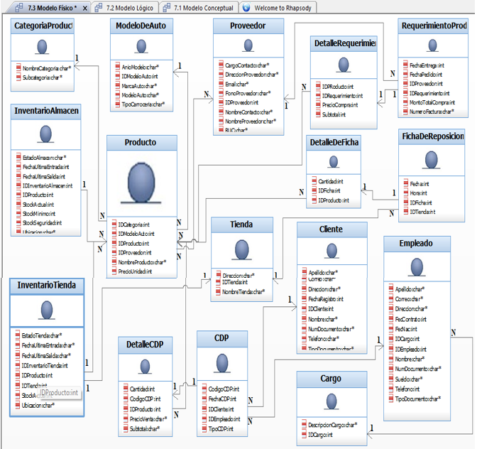

# SUPERCAR System Analysis and Design

This project presents the analysis and design of an inventory and order management system for an auto parts company.

The objective of the system is to improve coordination between the main warehouse and three retail stores, allowing real-time inventory consultation, product requests, and order tracking.

## Project Objectives

- Improve inventory management
- Reduce internal order processing time
- Optimize communication between stores and warehouse
- Improve customer service efficiency

## Methodology

The project follows the **Agile Unified Process (AUP)** methodology and uses **UML (Unified Modeling Language)** for system modeling.

## Models Developed

The project includes:

- Business Use Case Model
- System Use Case Model
- Business Analysis Model
- Data Model
- Design Model
- System Architecture Model

## Key Components

The system allows:

- Real-time inventory consultation
- Product requests between stores and warehouse
- Order tracking (requested, in transit, delivered)
- Monthly inventory and sales reports
- Role-based access for employees

## Tools Used

- IBM Rational Rhapsody
- UML
- AUP Methodology

## Repository Structure

- README.md
- Informe_SUPERCAR_System_Analysis.pdf
- images

## Diagram

## Author

José Espinoza  
Arquitectura de Datos Empresariales – CIBERTEC
